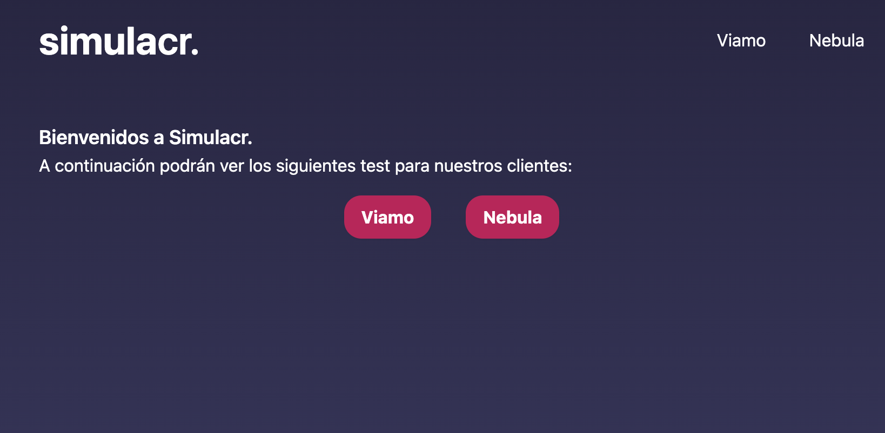

# GreyDive Challenge

Make an app in React.js that reads a JSON file and generates for each item, a new url or route with all its properties

[Live site](http://greydive-challenge-facundo.vercel.app)

## Screenshots



## Tech Stack

**Client:** React, Next.js, TailwindCSS

**Deploy:** Vercel


## Features

- Dynamic Routes for each test fetching data from database
- Used getStaticProps to statically generate pages with dynamic data
- Dynamically created pages routes with getStaticPaths

## Run Locally

Clone the project

```bash
  git clone https://link-to-project
```

Go to the project directory

```bash
  cd my-project
```

Install dependencies

```bash
  npm install
```

Start the server

```bash
  npm run dev
```

## Acknowledgements

- [Next.js Docs](https://nextjs.org/docs/getting-started)
- [Tailwind CSS Docs](https://tailwindcss.com/docs/installation)

## Author

- [Facundo Perez Montalvo](https://facuperezm.vercel.app)

[](https://facuperezm.vercel.app/)
[](https://www.linkedin.com/in/facuperezm/)
[](https://github.com/facuperezm)
